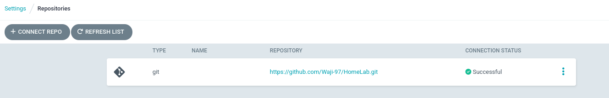

# ArgoCD Setup
ArgoCD is installed by default as ArgoCD is enabled in the kubespray custom variable file.

```bash
➜ k get po -n argocd
NAME                                                READY   STATUS    RESTARTS   AGE
argocd-application-controller-0                     1/1     Running   0          32m
argocd-applicationset-controller-865d876d77-hnf52   1/1     Running   0          33h
argocd-dex-server-66459bdb8f-j7kj4                  1/1     Running   0          33h
argocd-notifications-controller-78794ddcb5-ctjfm    1/1     Running   0          33h
argocd-redis-8846c4d6c-5gw42                        1/1     Running   0          33h
argocd-repo-server-5bc77b85cd-xr4fk                 1/1     Running   0          33h
argocd-server-847bbc55d9-4lsqz                      1/1     Running   0          33h
```

<br>

To access the ArgoCD Web UI, we can patch the argocd-server service to be `NodePort`
```bash
➜ kubectl patch svc argocd-server -n argocd -p '{"spec": {"type": "NodePort"}}'
```

<br>

> This step requires `argocd cli` to be installed beforehand. Install argocd cli from the official argocd github releases page.

Initial Admin password for argocd server can be found using the following command
```bash
➜ argocd admin initial-password -n argocd
```

### Connect HomeLab Github repo with ArgoCD
The HomeLab Github Repository is connected to the ArgoCD using a `Secret` resource. But as the resource contains sensitive data, we need to configure SOPS first. 

> To configure SOPS, `age` package & `sops` package are required. Install them from their official github release page.

Generating an age key is quite simple
```bash
➜ age-keygen -o age-key.txt
Public key: age1mp2c59e4sg6ey3d3fe5erw6ylylhjwfcmw4f827kpfrquxjd0ctsgtpzag
```
The above age-key needs to be moved under the sops config directory for the current user
```bash
➜ mkdir -p /home/waji/.config/sops/age
➜ mv age-key.txt /home/waji/.config/sops/age/keys.txt
```

Then create a `.sops.yaml` file in main

Finally, to encrypt the github repo secret file
```bash
➜  argocd git:(main) ✗ sops -e -i repo-secret.yaml
```

To apply the encrypted `repo-secret.yaml` file, use the following command
```bash
➜  argocd git:(main) ✗ sops -d repo-secret.yaml | kubectl apply -f -
secret/homelab-repo created
```

Verify the secret
```bash
➜ k get secret -n argocd | grep homelab
homelab-repo                  Opaque   4      80s
```

Verify from the UI


<br>

### Patch ArgoCD ConfigMap
The following patch is required to:
- Enable Helm templating using Kustomize
- Enable App-of-Apps health check for custom resources

```bash
➜  argocd git:(main) ✗ k patch cm -n argocd argocd-cm --type=merge --patch-file argocd-cm-patch.yaml
configmap/argocd-cm patched
```


### Create Root Application for App-of-Apps
Deploy the root application under respective cluster's directory
```bash

```
