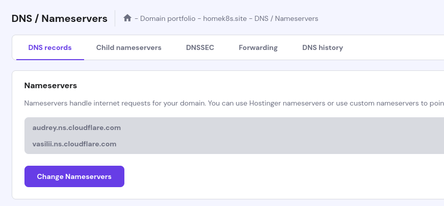

# DNS for External Access
Using Cloudflare & Hostinger to access Ingress Exposed Websites inside the home cluster.

### Domain Configuration
Hostinger offers cheap domain names so opted to buy a domain from hostinger. The DNS server settings need to be set towards cloudflare DNS servers as defined below

After that, the public IP (home-router's Public IP) needs to be added in the `DNS management` corner in Cloudflare dashboard as an A record (wildcard record).

> The Nginx LoadBalancer Service will have an External IP allocated that needs to be set in the home-router's Port Forwarding (443 after Cert-Manager configured with TLS) settings so all requests towards the Domain name is translated towards the Ingress Nginx Controller.