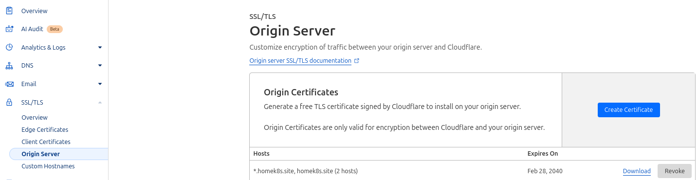

# Default TLS for Ingress Controller
I miserably failed with cert-manager. Deploying the helm chart with argocd always gave me an tls bad cert error so I opted for the default SSL cert.

Anyways, there is a `default-ssl-certificate` argument in the nginx ingress controller which is enabled and it refers to `ingress-tls` secret inside `ingress-nginx` namespace. 

Firstly, the TLS cert is needed. Let's Encrypt is good but Cloudflare offers 15 years free certificate. From the cloudflare dashboard, create a TLS cert.



It will give us a `.key` and `.crt` file which will be used to create the secret file as below

```bash
kubectl create secret tls ingress-tls --key=homek8s.site.key --cert=homek8s.site.crt -n ingress-nginx --dry-run=client  -o yaml
```
<br>

After that sops will be used once again to encrypt the secret before pushing to Github (Of course it will be applied manually)

```bash
➜  ingress-nginx git:(main) ✗ sops -e -i ingress-tls-secret.yaml
➜  ingress-nginx git:(main) ✗ sops -d ingress-tls-secret.yaml| kubectl apply -f -
secret/ingress-tls created

➜  ingress-nginx git:(main) ✗ k get secret -n ingress-nginx | grep ingress-tls
ingress-tls               kubernetes.io/tls   2      11s
```

### Ingress Object Config
Each ingress object needs to have the following annotation
```bash
nginx.ingress.kubernetes.io/force-ssl-redirect: "true"
```

### Basic Auth for Ingress
As the Ingress is exposed externally, anyone who knows the domain name can easily view the applications without auth. For a little 'safety', ingress offers a basic auth. 

To set up the user
```bash
➜ sudo apt install apache2-utils

➜ htpasswd -c auth <username>
New password: 
Re-type new password: 
Adding password for user <username>

➜ ls auth
auth
```

Then the above data needs to go in a Secret resource
```bash
➜ k create secret generic basic-auth --from-file=auth -n ingress-nginx -o yaml --dry-run=client
apiVersion: v1
data:
  auth: <base64 encrypted password>
kind: Secret
metadata:
  creationTimestamp: null
  name: basic-auth
  namespace: ingress-nginx
```

> Used sops to deploy the above secret manually as well

Other than that, the controller needs to mount the above secret and each ingress object will require the below annotation
```bash
    nginx.ingress.kubernetes.io/server-snippet: |
      auth_basic "basic-auth";
      auth_basic_user_file /etc/apache2/auth;           ## ==> the path where secret will be mounted
```